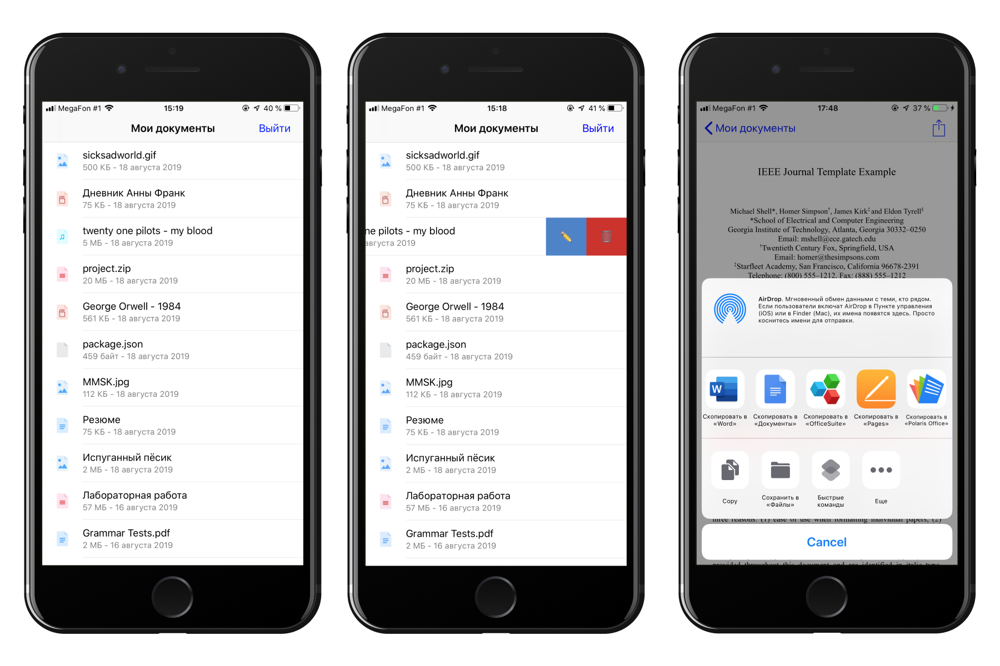

# VKDocuments
###### Приложение для работы с документами из ВКонтакте

### Зависимости
В качестве менеджера зависимостей использовался [Carthage](https://github.com/Carthage/Carthage).
Запустите `carthage update --platform iOS`, чтобы установить все необходимые зависимости перед запуском проекта.

- [Alamofire](https://github.com/Alamofire/Alamofire) - для работы с сетью
- [SVProgressHUD](https://github.com/SVProgressHUD/SVProgressHUD) - индикатор загрузки

### Функционал приложения
- Отображение списка файлов
- Переименование и удаление файлов
- Предпросмотр файлов в приложении
- Открытие документов в сторонних приложениях

### Что дальше?
- [ ] Корректная работа всех сценариев работы приложения с плохим интернетом и его отсутвием
- [ ] Просмотр файлов друзей и сообществ
